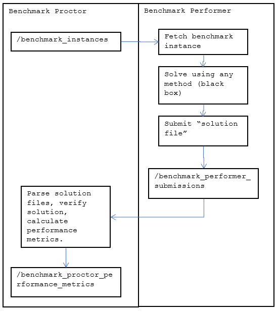

# Sampling Benchmark

See also the corresponding Microsoft Word document describing the benchmark submitted in the T011 month-18 deliverables.

### Benchmark Workflow Overview

### Examples

Jupyter Notebooks are provided as examples of steps in the workflow.

* [examples/01_introduction.ipynb](./examples/01_introduction.ipynb) Provides an introduction to the [`sampling.py`](./src/sampling.py) classes and methods.  Benchmark performer usage of `sampling.py` is optional.
* [examples/01b_overview_of_benchmark_instances.ipynb](./examples/01b_overview_of_benchmark_instances.ipynb) Shows images of each graph and instance considered.
* [examples/02_energy.ipynb](./examples/02_energy.ipynb) Provides an overview of how ''energy'' is calculated for each graph, for each ''spin configuration'' state.
* [examples/03_brute_force_probability_distribution_calculation.ipynb](./examples/03_brute_force_probability_distribution_calculation.ipynb) Calculates the exact probability distribution function (PDF) for a small instance.
* [examples/04_mcmc.ipynb](./examples/04_mcmc.ipynb) Provides an example of acting as the ``benchmark performer'' and generating samples by the Monte Carlo Markov Chain (MCMC) (with Metropolis-Hastings proposal/acceptance rules).  The true benchmark performer is not required to us MCMC.  The true benchmark performer may use any method to generate samples.
* [examples/05_verification_of_samples.ipynb](./examples/05_verification_of_samples.ipynb) A placeholder for a longer discussion on using the [Graphical Model Learning](https://github.com/lanl-ansi/GraphicalModelLearning.jl) method from Los Alamos National Lab (LANL) as a verification procedure.
* [examples/06a_example_benchmark_performer_workflow.ipynb](./examples/06a_example_benchmark_performer_workflow.ipynb) Provides an example of acting as the ''benchmark performer'' and generating samples by MCMC and writing the solution file to the `benchmark_performer_submissions` directory.  NOTE:  we currently use MCMC as the ''state of the art'' to establish utility thresholds.
* [examples/06b_example_benchmark_proctor_workflow.ipynb](./examples/06b_example_benchmark_proctor_workflow.ipynb) Provides an example of acting as the ''benchmark proctor'', pulling a solution file from the `benchmark_performer_submissions` directory and calculating performance metrics. This workbook is written in Julia.
* [examples/07_utility_estimate_scaling_plots.ipynb](./examples/07_utility_estimate_scaling_plots.ipynb) Calculates the blended, relatively normalized utility score vs. performance metrics score plot.

### License

See [LICENSE](LICENSE).